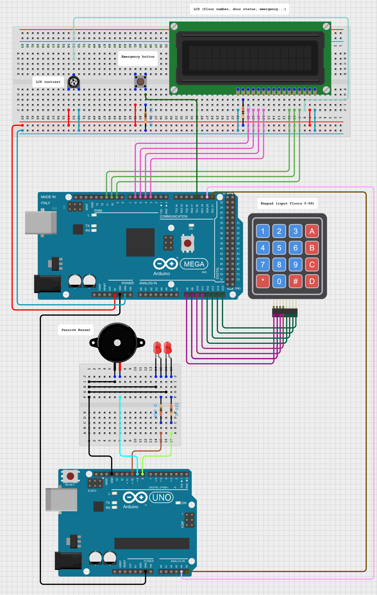
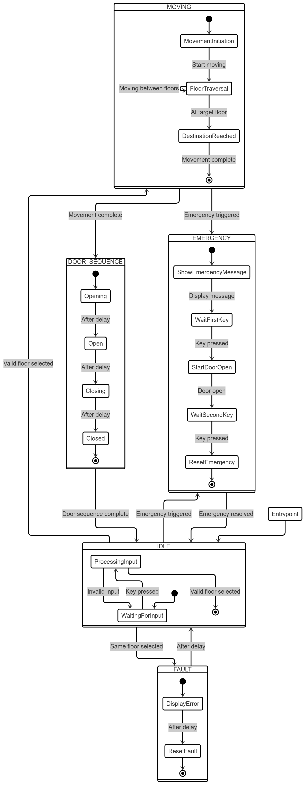

# BL40A1812 Embedded Systems Project: Elevator

## Quick Menu

- [Project Overview](#project-overview)
- [Hardware Components](#hardware-components)
- [Software Architecture](#software-architecture)
  - [Communication](#communication)
  - [State Machine](#state-machine)
  - [Interrupt System](#interrupt-system)
- [Building and Running](#building-and-running)
- [Debugging](#debugging)
- [License](#license)
  - [External Libraries](#external-libraries-and-sources)

## Project Overview

This project simulates an elevator system using two Arduino boards (MEGA and UNO) communicating via I2C. The system implements a state machine to handle elevator operations, user inputs, and emergency situations.

## Hardware Components

- **Arduino MEGA**: Main controller handling user interface and state management
- **Arduino UNO**: Slave device controlling LEDs and buzzer
- **LCD Display**: 16x2 character display for user interface
- **Keypad**: 4x4 matrix keypad for floor selection
- **LEDs**: Status indicators for movement and door state
- **Buzzer**: Audio feedback for various events
- **Emergency Button**: External interrupt for emergency situations
- **Wiring diagram**: [app.cirkitdesigner.com](https://app.cirkitdesigner.com/project/b8007782-8189-49b1-a20a-cda4cfcbd284)

## Software Architecture

### Communication

- **I2C Protocol**: Master-Slave communication between MEGA and UNO
  - Implementation: [Common/twi.c](Common/twi.c), [Common/twi.h](Common/twi.h)
- **Message Format**: 32-bit messages with control flags and data
  - Protocol: [Common/message.h](Common/message.h)
- **Debug Interface**: USART communication for system monitoring
  - Implementation: [Common/usart.c](Common/usart.c), [Common/usart.h](Common/usart.h)

### State Machine

The elevator operates in the following states:

- **IDLE**: Waiting for user input
- **MOVING**: Elevator in motion between floors
- **DOOR_OPENING**: Door opening sequence
- **DOOR_OPEN**: Door fully open
- **DOOR_CLOSING**: Door closing sequence
- **EMERGENCY**: Emergency mode activated

### Interrupt System

The system utilizes three types of interrupts:

1. **TWI Interrupts**: Handle I2C communication between boards
2. **External Interrupts**: Process emergency button presses
3. **Timer Interrupts**: Control melody playback and timing

## Building and Running

1. Connect the hardware components as per the pin configuration
2. Upload the MEGA code to the Arduino MEGA
3. Upload the UNO code to the Arduino UNO
4. The system will initialize and begin operation

## Debugging

Both MEGA and UNO boards support debugging via USART:

- **MEGA Board**: [Mega/main.c](Mega/main.c)
  - Debug port: 9600 baud
  - Provides state machine and user interface debugging
  
- **UNO Board**: [Uno/main.c](Uno/main.c)
  - Debug port: 9600 baud
  - Provides LED and buzzer control debugging

## License

This project uses modified versions of open-source libraries. See individual source files for specific licenses.

### External Libraries and Sources

- **Keypad Library**: [Mega/keypad.c](Mega/keypad.c) and [Mega/keypad.h](Mega/keypad.h)
  - Source: Course Moodle
  - Purpose: Handles 4x4 matrix keypad input
  
- **LCD Library**: [Mega/lcd.c](Mega/lcd.c) and [Mega/lcd.h](Mega/lcd.h)
  - Source: Course Moodle
  - Purpose: Controls 16x2 character LCD display
  
- **Melody Library**: [Uno/Buzzer.c](Uno/Buzzer.c) and [Uno/Buzzer.h](Uno/Buzzer.h)
  - Based on: [robsoncouto/arduino-songs](https://github.com/robsoncouto/arduino-songs)
  - Modifications: Adapted for AVR timers and project-specific sounds
  - Features: Multiple melodies including emergency, door, and entertainment sounds
